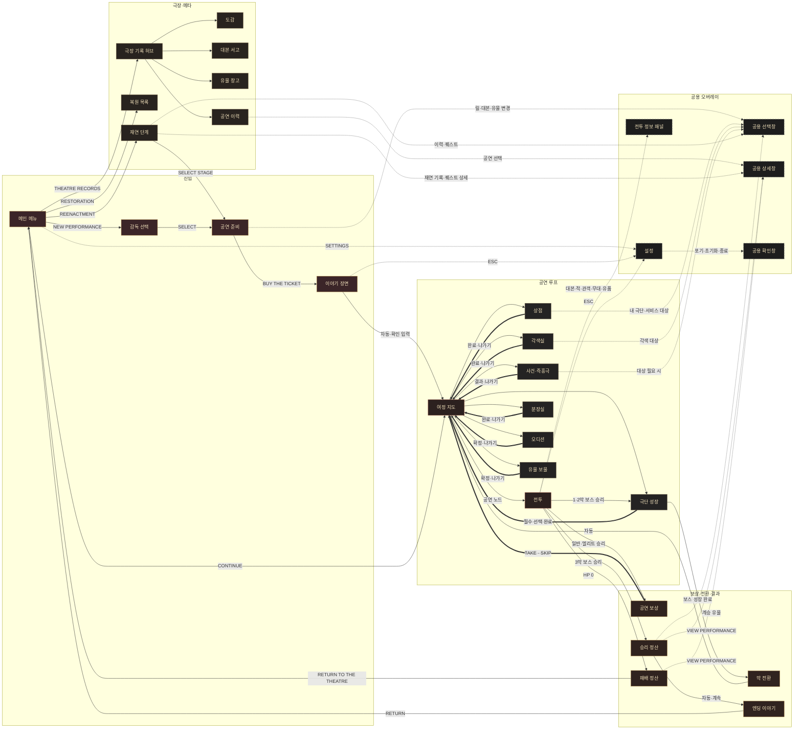

# UNDERSTUDY UI FLOW MAP

전체 UI 1차 시안의 버튼 이동과 오버레이 관계를 Figma에 옮기기 위한 기준 문서다.

현재 단계는 `00 FLOW MAP` 검토용이며, 화면 이미지를 새로 그리지 않고 `UI/`에 있는 1920×1080 시안만 사용한다.

## 연결선 규칙

| 표기 | Figma 동작 | 용도 |
|---|---|---|
| 실선 | `Navigate to` | 전체 화면 이동 |
| 점선 | `Open overlay` | 선택창, 상세창, 설정, 확인창 |
| 굵은 복귀선 | `Back` 또는 저장된 복귀 대상 | 지도·전투·이전 화면 복귀 |
| 자동 | `After delay` | 이야기, 막 전환, 결과 연출 |

## 전체 화면 흐름

## Figma 프레임 등록표

`01 FULL SCREENS`에는 아래 파일을 같은 이름의 1920×1080 프레임으로 배치한다.

| Frame ID | 화면 | 기준 이미지 |
|---|---|---|
| `FS-01` | 메인 메뉴 | `main-menu/preview-v3.png` |
| `FS-02` | 감독 선택 | `director-select/preview.png` |
| `FS-03` | 공연 준비 | `performance-prep/preview.png` |
| `FS-04` | 이야기 장면 | `story/preview.png` |
| `FS-05` | 극장 기록 허브 | `theatre-records/preview.png` |
| `FS-06` | 도감 | `compendium/preview.png` |
| `FS-07` | 대본 서고 | `theatre-records/preview-script-library-v2.png` |
| `FS-08` | 유물 창고 | `theatre-records/preview-relic-storage-final.png` |
| `FS-09` | 공연 이력 | `theatre-records/preview-performance-history.png` |
| `FS-10` | 복원 목록 | `restoration/preview-v4.png` |
| `FS-11` | 재연 단계 | `reenactment/preview-v2.png` |
| `FS-12` | 여정 지도 | `map/preview.png` |
| `FS-13` | 전투 | `combat/assembled-existing-ui-preview.png` |
| `FS-14` | 상점 | `shop/preview.png` |
| `FS-15` | 각색실 | `dramaturgy/preview.png` |
| `FS-16` | 사건·즉흥극 | `event/preview.png` |
| `FS-17` | 분장실 | `dressing-room/preview.png` |
| `FS-18` | 오디션 | `audition/preview-v2.png` |
| `FS-19` | 유물 보물 | `relic-treasure/preview-v2.png` |
| `FS-20` | 극단 성장 | `troupe-growth/preview-v4.png` |
| `FS-21` | 막 전환 | `act-transition/preview.png` |
| `FS-22` | 승리 정산 | `run-result/preview-victory-v2.png` |
| `FS-23` | 패배 정산 | `run-result/preview-defeat-v1.png` |

## 오버레이 등록표

`02 COMPONENTS`에서 원본 크기를 유지하고, `03 PROTOTYPE`에서는 호출 화면 위에 중앙 정렬한다.

| Overlay ID | 구성 | 기준 이미지 |
|---|---|---|
| `OV-01` | 공연 보상 | `reward/preview.png` |
| `OV-02` | 공용 선택창 | `overlays/preview-picker-script.png` |
| `OV-03` | 공용 상세창 | `overlays/preview-details-performance-v3.png` |
| `OV-04` | 설정 | `system-menu/preview-settings-audio.png` |
| `OV-05` | 공용 확인창 | `system-menu/preview-confirm-abandon.png` |
| `OV-06` | 전투 상세·상태 | `combat-info/preview-combat-collapsed-default.png` 외 상태 이미지 |
| `OV-07` | 사용 가능 상태 | `overlays/preview-state-availability.png` |
| `OV-08` | 빈 목록·NEW·해금 | `overlays/preview-state-empty-new-unlock.png` |

## 프로토타입 규칙

- 이미지 속 실제 버튼 위에만 투명 핫스팟을 둔다. 화면 전체를 임의의 다음 화면 버튼으로 사용하지 않는다.
- 전체 화면 이동은 `Dissolve 150ms`, 오버레이는 `Instant`, 이야기 전환은 `Dissolve 250ms`로 통일한다.
- `ESC`, `BACK`, `CANCEL`은 직전에 열었던 화면으로 돌아간다.
- 지도에서 열린 노드 화면은 완료 후 항상 같은 지도 프레임으로 복귀한다.
- 전투 정보는 각각 새 전체 프레임을 만들지 않고 전투 프레임 위 오버레이 variant로 연결한다.
- `CONTINUE`는 실제로는 저장된 화면을 복원하지만 프로토타입에서는 여정 지도로 연결한다.
- 막 전환은 클릭 핫스팟 없이 `After delay`로 다음 막 지도에 연결한다.
- 커튼 닫힘 로딩 커버는 모든 화면 사이에 넣지 않고 막 전환과 무대 교체에만 사용한다.

## 이번 검토에서 확인할 것

1. 메인 메뉴에서 `RESTORATION`과 `REENACTMENT`를 직접 노출할지, 극장 기록 허브 아래로 넣을지.
2. 보스 승리 후 `극단 성장 → 막 전환` 순서가 실제 규칙과 맞는지.
3. 승리 정산 뒤 엔딩 이야기를 거쳐 메인으로 가는지, 메인 복귀 후 해금 이야기로 분리할지.

